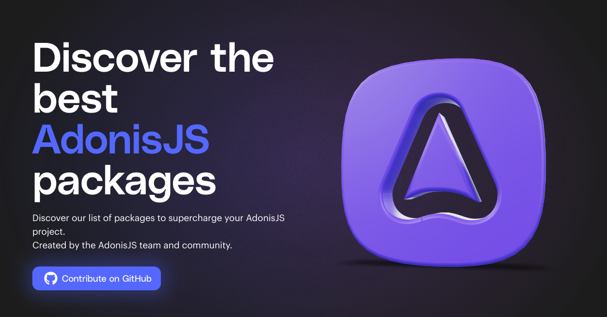

  <h3>AdonisJS Packages</h3>
  
Discover the best AdonisJS packages

## Introduction

This is the source code of the [AdonisJS Packages](https://adonisjs.com/packages) website. The website is built using:

- [AdonisJS](https://adonisjs.com)
- [VueJS](https://vuejs.org/)
- [InertiaJS](https://inertiajs.com/)
- [UnoCSS](https://unocss.dev/)
- [Vite](https://vitejs.dev/)
- [BentoCache](https://bentocache.julr.dev/)
- [Japa](https://japa.dev/)

If you are looking for a good starting point to learn AdonisJS, then this repo may be a good starting point for you. It is a simple website, but it covers a lot of concepts like:

- How we can super easily build a monolithic application using AdonisJS, InertiaJS and VueJS and still have a SPA feeling. No state management, routing, API calls, loading spinners, error management needed front-end side.
- IoC container and Dependency injection using AdonisJS. For example, we leverage them to easily test our controller and commands without having to fetch real data from npm and GitHub APIs
- Developing custom commands with pretty prompts and spinners using AdonisJS Ace
- Testing commands, controllers, and service using IoC container, API Client, and Inertia test helpers
- [End-to-end testing](./tests/browser/) using Playwright
- [Dockerize the application](./Dockerfile) in order to make it easy to deploy
- GitHub Actions CI/CD: we use GitHub Actions to run our [tests, check linting, type checking](.github/workflows/checks.yml) and [build the application image](.github/workflows/on-push-to-main.yml) before deploying it to our server
- Caching using BentoCache: instead of calling the npm and GitHub APIs on each request, we use a 2-layer (Memory + SQLite) cache system to store the data and refresh it only when needed. See [./config/cache.ts](./config/cache.ts) for more details.
- How to setup Vite/ESLint ([Flat config](https://eslint.org/docs/latest/use/configure/configuration-files-new))/Prettier/TSconfig
- Payload validation using VineJS

## Contributions

### Add a new package

The packages database is a simple collection of YAML files, where each file represents a package. Files are located in [./content/packages](./content/packages) directory. If you want to add a new package, you can create a new file in the same directory, or preferably, use the `node ace add:package` command.

#### Custom Icon

If you want to add an icon for you package, make sure to pick an appropriate image, not too big, not too small, in correct quality. Once you have the image, make sure to add it in `/public/icons` directory, and then add the path in the `icon` field of your package yaml file.

#### Launch the website

In order to run the website locally, you need to:

- Install dependencies using `pnpm install`
- Compile the package database using `node ace build:packages`
- Create your `.env` file using the `.env.example` file. Use `node ace generate:key` to generate a new key and, not mandatory, use `gh auth token` to generate a new Github token.
- Migrate and seed your database using `node ace migration:fresh --seed`
- Start the dev server using `node ace serve --watch`

Then you can visit the website at `http://localhost:3333`
